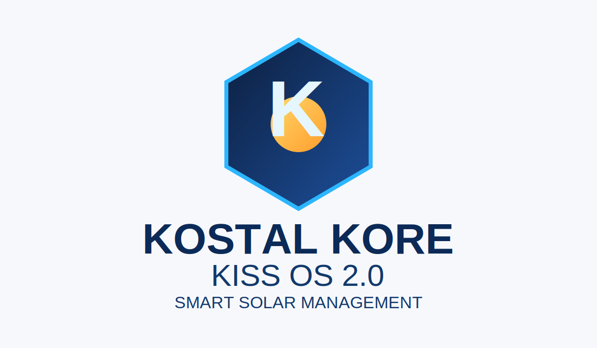

# KOSTAL KORE for Home Assistant (Experimental Alpha)

> Powered by **KOSTAL KISS OS 2.0**
>
> **Alpha release notice:** This release is intended for real-world testing with early adopters.  
> Please report issues and attach diagnostics: <https://github.com/Puma7/Kostal/issues>

KOSTAL KORE is a custom Home Assistant integration for monitoring and controlling Kostal Plenticore inverters using local interfaces (REST + optional Modbus tooling).



## Credits & Transparency

- **Thank you to the original author**: This project builds on years of groundwork by `@stegm`, especially the foundational `pykoplenti` repository: <https://github.com/stegm/pykoplenti>.
- **Why this exists as a separate line**: Scope and architecture changed heavily over time, so a clean merge back into the original repository was not feasible.
- **Stability disclosure**: This integration is heavily vibe-coded and is **not considered 100% stable**.
- **Real-world usage disclaimer**: It runs in `@Puma7`'s own setup (Kostal Plenticore G3 L 20kW), but that does **not** guarantee identical behavior on all hardware, firmware, or regional setups.
- **AI disclosure**: Large parts of this codebase were generated with **Claude Opus** and **OpenAI Codex**.
- **Human validation**: Manual checks were performed by `@Puma7`.

## Overview

This integration provides comprehensive monitoring and control capabilities for Kostal Plenticore solar inverters, allowing you to:
- Monitor real-time power production and consumption
- Track energy generation statistics
- Control inverter settings and operating modes
- Access detailed inverter status and diagnostic information

### Why KOSTAL KORE?
KOSTAL KORE transforms your inverter from a simple energy source into a controllable automation node for Home Assistant.  
With KISS OS 2.0 architecture goals, KORE focuses on stable control channels, actionable diagnostics and practical interoperability for advanced setups.

## Features

### 🚀 KORE Launch Gadgets
- **KORE FlowBridge**: Optional Modbus proxy + MQTT bridge for EVCC, Wallbox and automation stacks.
- **KORE Safety Sentinel**: Early-warning diagnostics for isolation, thermal and grid anomalies.
- **KORE GridGuard**: Grid feed-in optimization and battery control helpers with inverter-aware limits.
- **KORE Insight Pack**: Health, degradation and longevity entities prepared for dashboarding.

### 📊 **Sensors**
- **Power Monitoring**: Real-time AC/DC power measurements, voltage, current
- **Energy Tracking**: Daily, monthly, and total energy production statistics
- **Inverter Status**: Operating state, temperature, and health indicators
- **Grid Information**: Grid frequency, power factor, and grid connection status

### 🧮 **Calculated Sensors (New)**
- **Total Grid Consumption**: Smart calculation of `Grid to Home + Grid to Battery`
- **Total Battery Discharge**: Comprehensive `Battery to Home + Battery to Grid` tracking
- **Battery Efficiency**: Real-time efficiency monitoring (`Output / Input`) in %
- **Dashboard Ready**: Fully compatible with Home Assistant Energy Dashboard

### 🎛️ **Controls**
- **Number Entities**: Adjustable power limits, charge/discharge rates
- **Select Entities**: Operating mode selection (e.g., battery management modes)
- **Switch Entities**: Enable/disable various inverter functions
- **G3 Battery Limitation**: Max charge/discharge power limits are re-applied cyclically to keep them active (per vendor requirement)
- **Entity Naming**: Entities now use device-based naming for a cleaner UI (see `custom_components/kostal_kore/QUICK_REFERENCE.md` for full lists)

### 🔧 **Diagnostics**
- Comprehensive diagnostic data for troubleshooting
- Redacted sensitive information for privacy
- Integration version and API status information

## Supported Devices

- Kostal Plenticore Solar Inverters
- Compatible with firmware versions supporting local API access
- Requires network connectivity to the inverter

## Worldwide Compatibility & Safety

- **Inverter-size aware limits**: Control paths now derive limits from inverter capabilities (no fixed 20 kW restore values).
- **Generation-aware operation**: Designed for G1/G2/G3 variants with dynamic topology handling.
- **Grid profile adaptation**: Diagnostics and safety checks adapt to detected **50/60 Hz** and **120/230 V** profiles.
- **Secure defaults**: The optional Modbus proxy defaults to `127.0.0.1` to avoid accidental LAN exposure.

## Prerequisites

### Hardware Requirements
- Kostal Plenticore inverter with network connectivity
- Local network access to the inverter's web interface

### Software Requirements
- Home Assistant 2023.1 or newer
- Python package: `pykoplenti==1.5.0` (automatically installed)

### Network Requirements
- Inverter must be accessible on your local network
- TCP port 80 (HTTP) must be open to the inverter
- No firewall blocking between Home Assistant and inverter

## Installation

### Method 1: HACS (Recommended)
1. Open HACS in Home Assistant
2. Navigate to Integrations
3. Open the menu (top right) and select **Custom repositories**
4. Add repository URL: `https://github.com/Puma7/KostalKore`
5. Category: **Integration**
6. Install **KOSTAL KORE (Experimental Alpha)**
7. Restart Home Assistant
8. If shown, allow pre-release/alpha updates in HACS update settings

### Method 2: Manual Installation
1. Copy `custom_components/kostal_kore` to `config/custom_components/kostal_kore`
2. Restart Home Assistant
3. The integration will be available for configuration

## Migration from `kostal_plenticore` plugin (two-step flow)

If you previously used the `kostal_plenticore` integration:

1. Install and set up `KOSTAL KORE` first (new entry in Home Assistant).
2. Open the KOSTAL KORE device and click **Import Legacy Plenticore Data**.
3. KORE imports old config/options and migrates entity/device registry mappings, but keeps the legacy entry for safety/testing.
4. After your validation period, click **Finalize Legacy Cleanup** to remove old legacy artifacts and the old config entry.

This split flow lets you migrate first, test in production for a few weeks, and only then finalize cleanup.

Detailed step-by-step guide: see `migration.md`.

## Development

### Branches
- `develop` is the default branch for ongoing work.
- `main` reflects tagged release snapshots.

### Release Notes
See `RELEASE_NOTES.md` for the latest release highlights.
See `ALPHA_RELEASE_CHECKLIST.md` for HACS and security readiness details.

### Documentation map
- `README.md`: User-facing install/setup/operations overview.
- `migration.md`: Step-by-step migration guide from `kostal_plenticore` to `kostal_kore`.
- `PROXY_SETUP.md`: Modbus proxy + MQTT bridge integration examples (evcc/iobroker).
- `ENTITY_REFERENCE.md`: Entity/register and threshold reference.
- `custom_components/kostal_kore/QUICK_REFERENCE.md`: Fast maintainer cheat sheet.
- `custom_components/kostal_kore/AI_DOCUMENTATION.md`: AI-assistant context for repository internals.
- `CHANGELOG.md` + `RELEASE_NOTES.md`: Change history and release communication.

## Configuration

### Initial Setup
1. In Home Assistant, go to **Settings > Devices & Services**
2. Click **+ Add Integration**
3. Search for "KOSTAL KORE (Experimental Alpha)"
4. Enter the required information:
   - **Host**: Optional. Leave empty for auto-discovery or enter IP/hostname manually
   - **Password**: Inverter web interface password
   - **Service Code**: Optional for installer-level features
5. In step 2 of the wizard, directly enable:
   - Modbus TCP
   - MQTT Bridge
   - Modbus Proxy
6. The wizard shows detected access role (user vs installer) and whether write access is enabled

### Configuration Parameters
- **Host**: Optional. If empty, setup tries local-network auto-discovery first
- **Password**: Password for accessing the inverter's web interface
- **Service Code**: Optional service code. Actual write permissions are validated from detected account role.

## Data Update

The integration uses Home Assistant's `DataUpdateCoordinator` to fetch data from the inverter at regular intervals:

| Data Type | Update Interval | Description |
|-----------|----------------|-------------|
| Process Data (sensors) | 10 seconds | Real-time power, voltage, current measurements |
| Settings Data (numbers/switches) | 30 seconds | Battery limits, operating modes, switch states |
| Select Data (selects) | 30 seconds | Charging/usage mode selections |

- All API calls are serialised by the coordinator to avoid overloading the inverter.
- Settings data implements a last-result fallback for transient 503 errors.
- Failed API calls are automatically retried on the next coordinator cycle.

## Known Limitations

- **Auto-discovery is best-effort**: The wizard scans likely local IPv4 hosts when host is empty. If discovery fails, enter inverter host/IP manually.
- **DC string count**: The number of DC inputs (PV strings) is detected automatically on first setup. Changes require re-adding the integration.
- **Firmware dependency**: Some advanced settings (G3 battery controls, external control registers) are only available on specific firmware versions.
- **Installer access**: Certain controls require the installer/service code. Without it, these entities remain disabled.
- **Single inverter per entry**: Each config entry manages exactly one inverter. Multiple inverters require separate config entries.
- **API rate limits**: The inverter's local API has limited concurrency. The integration serialises all API calls to avoid overloading.
- **Battery entities**: Battery-related sensors only appear when a compatible battery system is connected and detected by the inverter.

## Integration Architecture

### File Structure
```
custom_components/kostal_kore/
├── __init__.py          # Integration entry point and setup
├── manifest.json        # Integration metadata and dependencies
├── config_flow.py       # Configuration flow and user interface
├── const.py            # Constants and configuration keys
├── coordinator.py       # API client and data coordination
├── sensor.py           # Power and energy sensors
├── number.py           # Numeric controls and settings
├── select.py           # Dropdown selections for modes
├── switch.py           # Toggle controls for functions
├── helper.py           # Utility functions and data formatters
├── diagnostics.py      # Diagnostic data collection
└── strings.json        # Localization strings
```

### Key Components

#### **coordinator.py**
- Manages API communication with the inverter
- Handles data updates and caching
- Provides device information and connection management
- Implements multiple coordinator types for different data sources

#### **sensor.py**
- Defines all sensor entities for monitoring
- Includes power, energy, voltage, current, and status sensors
- Implements proper device classes and units
- Handles data formatting and state management

#### **config_flow.py**
- Provides user-friendly setup interface
- Validates connection credentials
- Handles reconfiguration of existing entries
- Implements error handling and user feedback

## Available Entities

### Power & Energy Sensors
- `Inverter AC Power`: Current AC power output (W)
- `Inverter DC Power`: Current DC power input (W)
- `Total Energy Produced`: Lifetime energy production (kWh)
- `Daily Energy Produced`: Today's energy production (kWh)
- `Grid Frequency`: Current grid frequency (Hz)

### Status Sensors
- `Inverter State`: Current operating state
- `Inverter Temperature`: Internal temperature (°C)
- `Battery Level`: Battery charge level (%) [if applicable]

### Control Entities
- `Power Limit`: Maximum power output setting
- `Operating Mode`: Inverter operating mode selection
- `Battery Management`: Battery charging/discharging controls

## Inverter States

The integration provides human-readable inverter states:

| State Code | Description |
|------------|-------------|
| 0 | Off |
| 1 | Initializing |
| 2 | Insulation Measurement |
| 3 | Grid Check |
| 4 | Startup |
| 6 | Feeding In |
| 7 | Throttled |
| 8 | External Switch Off |
| 9 | Update |
| 10 | Standby |
| 11 | Grid Synchronization |
| 12 | Grid Pre-Check |
| 13 | Grid Switch Off |
| 14 | Overheating |

## Troubleshooting

### Connection Issues
1. **Cannot Connect**: Verify the inverter's IP address and network connectivity
2. **Invalid Auth**: Check the password for the inverter's web interface
3. **Timeout Error**: Ensure the inverter is responsive and not in maintenance mode

### Data Not Updating
1. Check the inverter's API status in the web interface
2. Verify network stability between Home Assistant and inverter
3. Review Home Assistant logs for API errors

### Installer Access Required
1. If Home Assistant shows an "Installer access required" repair issue, reconfigure the integration with the service code
2. Advanced battery controls will remain blocked until the service code is provided

### Performance Issues
1. Reduce polling frequency if experiencing slow response
2. Check network bandwidth and latency to the inverter
3. Monitor Home Assistant system resources

## Example Automations

### Limit Battery Charge Power (G3)
```yaml
service: number.set_value
target:
  entity_id: number.scb_battery_max_charge_power_g3
data:
  value: 10000
```

### Set Battery Charging / Usage Mode
```yaml
service: select.select_option
target:
  entity_id: select.scb_battery_charging_usage_mode
data:
  option: Battery:SmartBatteryControl:Enable
```

## Energy Dashboard Tips
- Use **Total Increasings** (e.g., battery charge/discharge totals) for Energy Dashboard entities.
- If a sensor stays `unavailable`, check if the inverter exposes the matching REST data ID.

## Debugging

Enable debug logging to troubleshoot issues:

```yaml
logger:
  default: info
  logs:
    pykoplenti: debug
    custom_components.kostal_kore: debug
```

## Security Considerations

- The integration stores the inverter password in Home Assistant's configuration
- Use a strong, unique password for your inverter
- Ensure your local network is secure
- Consider network segmentation for sensitive devices
- The Modbus proxy bind default is `127.0.0.1`; only expose it to LAN if strictly required
- Installer/service code is required for advanced battery control write paths

## API Documentation

This integration uses the Kostal Plenticore local API. For detailed API information:

### Technical Specifications
- **Protocol**: MODBUS-TCP with SunSpec Standard Compliance
- **Default Port**: TCP 1502 (MODBUS) and TCP 80 (Web API)
- **Default Unit-ID**: 71 (modifiable)
- **Data Models**: SunSpec Modbus models for solar inverters
- **Control Functions**: Advanced inverter control via MODBUS registers

### Supported Inverter Models
- **PIKO/PLENTICORE G1**: UI 01.30+
- **PLENTICORE G2**: SW 02.15.xxxxx+
- **PLENTICORE G3**: SW 3.06.00.xxxxx+
- **PLENTICORE MP G3**: SW 3.06.00.xxxxx+

### SunSpec Models Implemented
- **Model 1**: Common Model (Address 40003)
- **Model 103**: Three Phase Inverter (Address 40071)
- **Model 113**: Three Phase Inverter, float (Address 40123)
- **Model 120**: Nameplate (Address 40185)
- **Model 123**: Immediate Controls (Address 40213)
- **Model 160**: Multiple MPPT (Address 40239)
- **Model 2031**: Wye-Connect Three Phase (abcn) Meter (Address 40309)
- **Model 802**: Battery Base Model (Address 40416)
- **Model 65535**: End Model (Address 40480)

### Key MODBUS Registers
#### **Device Information**
- **Address 2**: MODBUS Enable (R/W)
- **Address 4**: MODBUS Unit-ID (R/W)
- **Address 14**: Inverter serial number (RO)
- **Address 38**: Inverter state (RO)
- **Address 56**: Overall software version (RO)

#### **Power Measurements**
- **Address 100**: Total DC power (W)
- **Address 172**: Total AC active power (W)
- **Address 252**: Total active power (powermeter) (W)
- **Addresses 258-286**: DC1-DC3 current, power, voltage
- **Addresses 320-326**: Total, daily, yearly, monthly yield (Wh)

#### **Battery Data**
- **Address 514**: Battery actual SOC (%)
- **Address 210**: Act. state of charge (%)
- **Address 214**: Battery temperature (°C)
- **Address 216**: Battery voltage (V)
- **Address 200**: Battery gross capacity (Ah)

#### **Control Registers**
- **Address 533**: Active Power Setpoint (%) (R/W)
- **Address 583**: Reactive Power Setpoint (%) (R/W)
- **Address 585**: Delta-cos φ Setpoint (R/W)
- **Addresses 1024-1044**: Battery management controls (R/W)

### Data Formats
- **U16**: Unsigned 16-bit integer (1 register)
- **U32**: Unsigned 32-bit integer (2 registers)
- **S16**: Signed 16-bit integer (1 register)
- **S32**: Signed 32-bit integer (2 registers)
- **Float**: IEEE 754 floating point (2 registers)
- **String**: Character data (variable length)

### MODBUS Function Codes
- **0x03**: Read Holding Registers
- **0x06**: Write Single Register
- **0x10**: Write Multiple Registers

### Inverter States
The inverter supports the following operational states:
- **0**: Off
- **1**: Init
- **2**: IsoMEas (Insulation Measurement)
- **3**: GridCheck
- **4**: StartUp
- **6**: FeedIn
- **7**: Throttled
- **8**: ExtSwitchOff
- **9**: Update
- **10**: Standby
- **11**: GridSync
- **12**: GridPreCheck
- **13**: GridSwitchOff
- **14**: Overheating
- **15**: Shutdown
- **16**: ImproperDcVoltage
- **17**: ESB (Emergency Shutdown)
- **18**: Unknown

### Energy Manager States
Internal energy flow management states:
- **0x00**: Idle
- **0x02**: Emergency Battery Charge
- **0x08**: Winter Mode Step 1
- **0x10**: Winter Mode Step 2

### Battery Types Supported
The integration supports various battery manufacturers:
- **0x0002**: PIKO Battery Li
- **0x0004**: BYD
- **0x0008**: BMZ
- **0x0010**: AXIstorage Li SH
- **0x0040**: LG
- **0x0200**: Pyontech Force H
- **0x0400**: AXIstorage Li SV
- **0x1000**: Dyness Tower / TowerPro
- **0x2000**: VARTA.wall
- **0x4000**: ZYC

### Documentation Reference
- Refer to the `BA_KOSTAL_Interface_MODBUS-TCP_SunSpec_with_Control.pdf` for complete register mapping
- The API follows SunSpec standards for Modbus-TCP communication
- Additional control functions may require installer-level access and service code

### Integration Implementation
- This integration uses the `pykoplenti` library which abstracts MODBUS-TCP communication
- Direct MODBUS access available for advanced users
- All SunSpec standard data points are exposed through Home Assistant entities

## Contributing

Contributions are welcome! Please:
1. Fork the repository
2. Create a feature branch
3. Make your changes
4. Test thoroughly
5. Submit a pull request

## Version History

- **Current**: `v2.16.0-alpha.4` (experimental release channel)
- **Compatibility**: Home Assistant 2024.1+
- **API Support**: Kostal Plenticore local API
- **Changelog**: See [CHANGELOG.md](CHANGELOG.md) for full history

## Support

For issues and questions:
1. Check the troubleshooting section above
2. Review Home Assistant logs for error messages
3. Open an issue: <https://github.com/Puma7/Kostal/issues>
4. Provide diagnostic data when reporting issues

### Alpha Feedback Program
- This is an **experimental alpha**. Production use is possible, but only with careful monitoring.
- Please include model generation (G1/G2/G3), inverter power class (e.g. 1kW, 3kW, 5kW, 20kW), and grid profile (50/60 Hz) in bug reports.

## License

MIT License. See [`LICENSE`](LICENSE).

---

**Note**: This integration communicates directly with your Kostal inverter over the local network. Ensure your network configuration maintains security and reliability for optimal performance.
